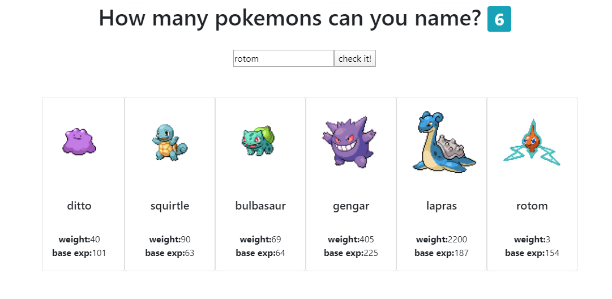

# How many pokemons can you name?
 
 Simple react app that challenges you to name pokemons, and lists the ones that you spelled correctly. 

## <a href="https://pablolucianop.github.io/mascotSpelling/" target="_blank" rel="noopener noreferrer">DEMO</a>

## Built With

* [React](https://reactjs.org/) - JavaScript library
* [Axios](https://github.com/axios/axios) - Promise based HTTP client for the browser and node.js
* [Pokeapi](https://pokeapi.co/) - The RESTful Pokémon API

## Author

* **Pablo Panza** 
<!--  [pablolucianop](https://github.com/pablolucianop), https://pablopanzatrabajos.com.ar/ -->

